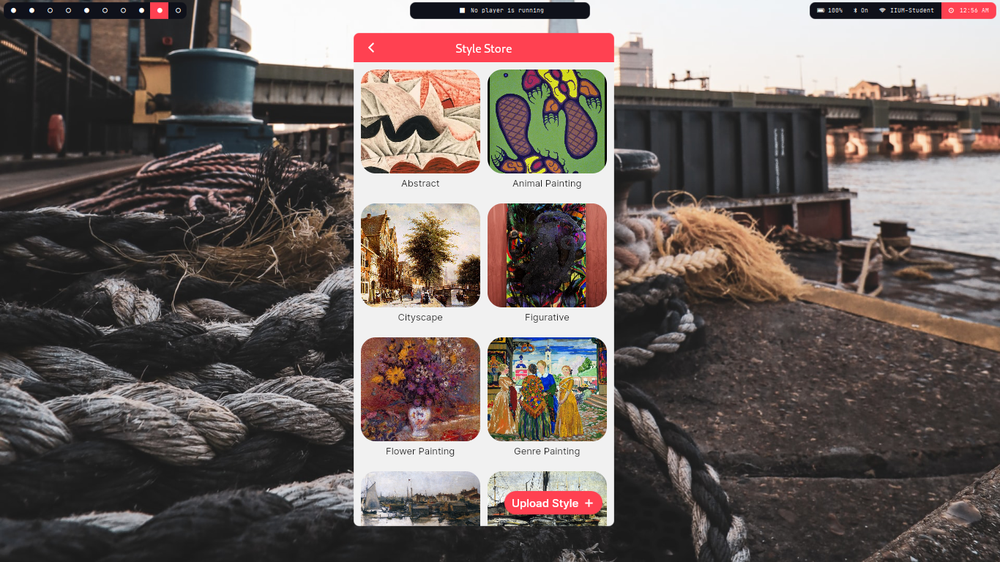
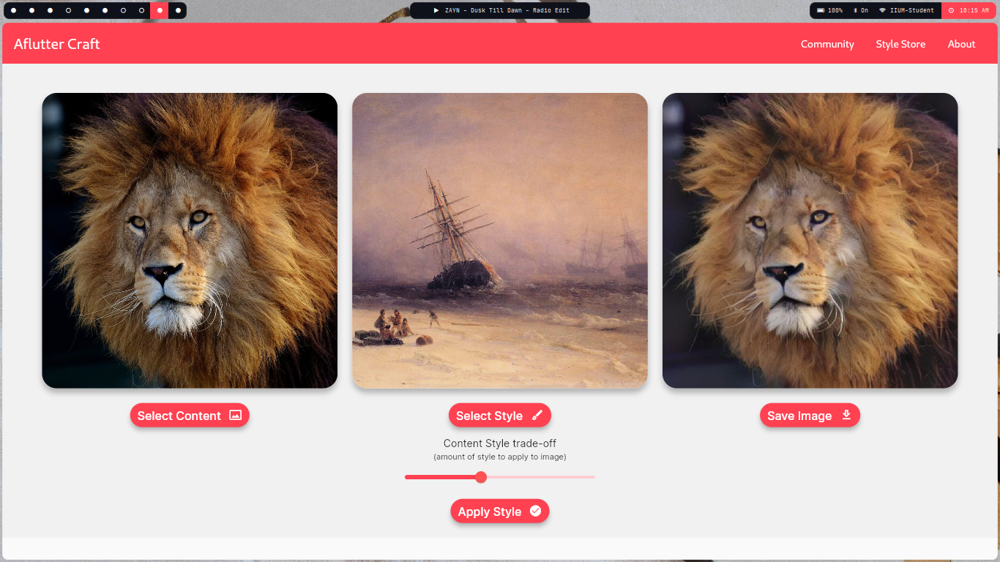
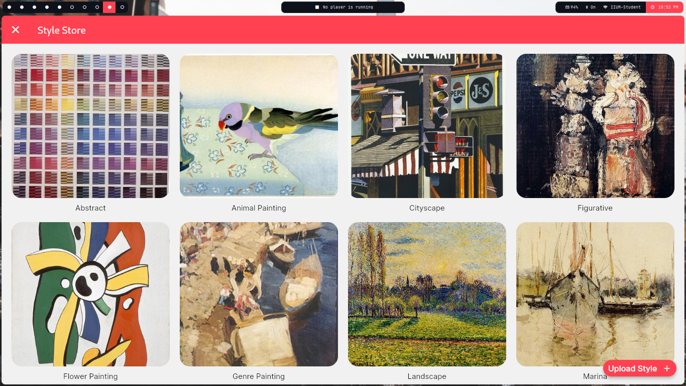
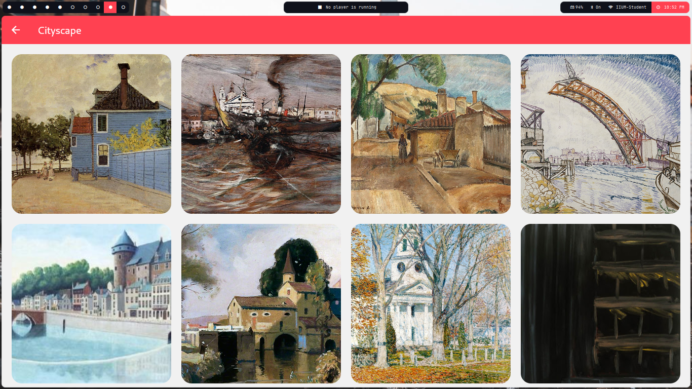
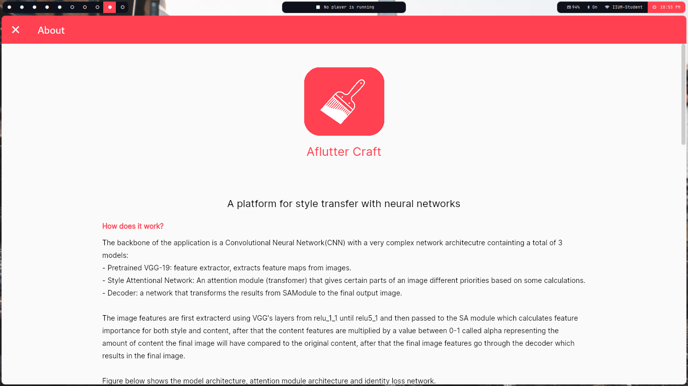

# aflutter_craft

A platform for image style transfer, this is the cross platform application, check here for the [API](https://github.com/Blacksuan19/Aflutter-Craft-API).

## Supported Platform

the code is written with all platform is mind, however it was only tested on:

- Android
- Linux
- Web

## Getting started

this project is fully null-safe and uses the master channel of flutter.

- first switch to the master branch with `flutter channel master`
- fetch the packages with `flutter pub get`
- start coding or building for a specific platform.
- for details on how to build:
  - [Web](https://flutter.dev/docs/deployment/web)
  - [Linux](https://flutter.dev/docs/deployment/linux)
  - [Android](https://flutter.dev/docs/deployment/android)
  - [IOS](https://flutter.dev/docs/deployment/ios)
  - [windows](https://flutter.dev/desktop#windows)

## Directory Structure

```
lib
├── models          # data models
├── screens         # application pages
│   ├── common      # pages common between all platforms
│   ├── desktop     # desktop/web pages
│   └── mobile      # mobile pages
├── utils           # utilities
└── widgets         # components
```

## Screenshots










